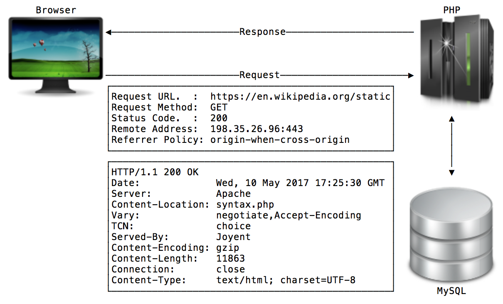

### Introduction
### to
## PHP

---

Web Programming Concepts
------------------------



+++

Server-side Techniques
----------------------

- Server-side scripting requires installation and setup on the server-side
- Clients is unaware that the HTML was produced by the server-side script. |
- Does NOT require any installations, add-ons or plugins on the client. |

+++

Client-side Techniques
----------------------

- Requires that the client supports the techniques.
- Javascript |
- Flash |
- Applet |

+++

Things that make you go... HMMM!?
---------------------------------

- Difference between a Web application and site?
- Rich internet application |
- AJAX |
- Thin client |
- Full application running in the browser or just static pages? |

---

What is PHP?
------------

- Loosely typed scripting language
- Interpreted at runtime (uses an opcode cache) |
- Commonly used to build web applications |

+++

Who uses PHP?
-------------

- Yahoo
- Facebook |
- Wordpress |
- 20 plus million other domains |

+++

Brief History
-------------

- Created by Rasmus Lerdorf
- PHP 1.0 released in 1995 |
- PHP 2.0 released in 1997 |
- PHP 3.0 released in 1998 |
- PHP 4.4 released in 2005 |

+++

Brief History
-------------

- New object model
- PHP 5.0 released in 2004 |
- PHP 5.3 released in 2009 |
- rewrite |
- PHP 7.1 released in 2016 |

---

Syntax
------

```
<?php
// hello.php
echo 'Hello, WSU CS3620' . PHP_EOL;
?> // Actually not required any more
```

+++

Variable Assignment
-------------------

```
<?php
// hello.php
$hello = 'Hello, WSU CS3620' . PHP_EOL;
echo $hello;
```

+++

Multi-line Comments
-------------------

```
<?php
/*
 * This is a multi
 * line comment!
 *
 * Also known as a
 * DocBlock comment.
 */
 ```

+++

Primitive Data Types
--------------------

```
<?php
$isPHPProgrammer = true;                        // boolean
$howOldIsPHP = 15;                              // integer
$pi = 3.14;                                     // float
$event = '<div name="div0">WSU CS-3620</div>';  // string
$event2 = "WSU CS-3620";                        // string
```

---

Conditionals (if)
-----------------

```
<?php
if (true) {
    echo 'Yes';
}
```

```
<?php
if (true) echo 'Yes';
```

```
<?php
if (true)
    echo 'Yes';
```

+++

Conditionals (if-then-else)
---------------------------

```
<?php
if (false) {
    echo 'No';
} else {
    echo 'Yes';
}
```

+++

Conditionals (if-then-else-if)
---------------------------

```
<?php
if (false) {
    echo 'No';
} elseif {
    echo 'No';
} else {
    echo 'Yes';
}
```

+++

Conditionals (switch)
---------------------

```
<?php
switch ($string_variable) {
    case 'Ruby':
        echo 'No';
        break;
    case 'PHP':
        echo 'Yes';
        break;
    default:
        echo 'IDK';
}
```

+++

Conditionals (switch)
---------------------

Do your BEST to NOT to 
use the **switch** or
the **if-then-else-if**!

Makes it harder to follow
or maintain the code!

---

Operators (arithmetic)
----------------------

```
<?php
$a = 10;
$b = $a + 1; // 11 
$c = $a - 1; // 9 
$d = $a * 5; // 50 
$e = $a / 2; // 5 
$f = $a % 3; // 1
```

+++

Operators (strings)
-------------------

```
<?php
$myString = 'foo' . 'bar'; // foobar
$myString .= 'baz';        // foobarbaz
```

---

Comparison (equivalence)
------------------------

```
<?php
if (2 == 3) { echo 'No'; }
if (3 == '3') { echo 'Yes'; }
if (2 != 3) { echo 'Yes;' }
```

+++

Comparison (identity)
---------------------

```
<?php
if (3 === '3') { echo 'No'; }
if (3 === 3) { echo 'Yes'; }
if (3 !== 4) { echo 'Yes;' }
```

+++

Comparison (logic)
------------------

```
<?php 
// NOT 
if (!true) { echo 'No'; } 
// AND 
if (true && false) { echo 'No'; } 
// OR 
if (true || false) { echo 'No'; }
```

---

Strings
-------

```
<?php
$x = 2;
echo 'I ate $x cookies';
echo 'I ate ' . $x . ' cookies';
echo "I ate $x cookies";
echo "I ate \$x cookies"; // I ate $x cookies
echo "I ate {$x} cookies";
```

---

Constants (old school)
----------------------

```
<?php
define('HELLO', 'Hello, WSU CS-3620');
echo HELLO;
```

+++

Constants (new school)
---------

```
<?php
const HELLO = 'Hello, WSU CS-3620';
echo HELLO;
```

---

Arrays (automatic)
------------------

```
<?php
$foo[] = 'bar'; // [0] => bar
$foo[] = 'baz'; // [1] => baz
```

+++

Arrays (explicit)
-----------------

```
<?php
$foo[0] = 'bar'; // [0] = bar
$foo[1] = 'baz'; // [1] = baz
```

+++

Arrays (construction)
---------------------

**new**

```
<?php
$foo = [
    'bar',
    'baz',
];
```

**old**

```
<?php
$foo = array(
    'bar',
    'baz',
);
```

+++

Arrays (construction)
---------------------

**new**

```
<?php
$foo = [
    0 => 'bar',
    1 => 'baz',
];
```

**old**

```
<?php
$foo = array(
    0 => 'bar',
    1 => 'baz',
);
```

+++

Arrays (key, value)
-------------------

```
<?php
$foo = [
    'a' => 'bar',
    'b' => 'baz',
];
```

---

Iterators (while, do-while)
---------------------------

```
<?php
$x = 0;
while ($x < 5) {
    echo '.';
    $x++;
}
```

```
<?php
$x = 0;
do {
    echo '.';
    $x++;
} while($x < 5);
```

+++

Iterators (for)
---------------

```
<?php
for ($i = 0; $i < 5; $x++) {
    echo '.';
}
```

+++

Iterators (foreach)
-------------------

```
<?php
$x = [0, 1, 2, 3, 4, 5, 6, 7, 8, 9];
foreach($x as $y) {
    echo $y;
}
```

```
<?php
$talks = [
    'php'  => 'Intro to PHP',
    'ruby' => 'Intro to Ruby',
];
foreach ($talks as $id => $name) {
    echo "$name is talk ID $id." . PHP_EOL;
}
```

---

Functions (built-in)
--------------------

```
<?php 
echo strlen('Hello'); // 5 
echo trim(' Hello '); // Hello 
echo count(array(0, 1, 2, 3)); // 4 
echo uniqid(); // 4c8a6660519d5 
echo mt_rand(0, 9); // 3 
echo serialize(42); // i:42; 
echo json_encode(array('a' => 'b')); // {"a":"b"}
```

+++

Functions (user-defined)
------------------------

```
<?php 
function add($x, $y) {
    return $x + $y;
}

echo add(2, 4); // 6
```

---


# QUESTIONS?